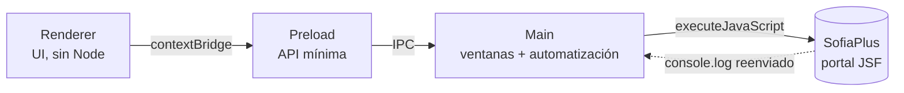

# AIA — Ahorro Instructor Automatizado

Aplicación de escritorio que automatiza el registro de tiempos de instructores en el portal
**SofiaPlus** del SENA, a partir de un archivo Excel de nómina.

En lugar de repetir a mano once pasos en el portal —inicio de sesión, navegación por cuatro
menús, filtros de fecha, búsqueda del instructor por cédula y selección del registro—, la
aplicación los ejecuta sola y muestra el progreso paso a paso.

---

## Tabla de contenidos

- [Qué hace](#qué-hace)
- [Cómo funciona](#cómo-funciona)
- [Requisitos](#requisitos)
- [Instalación](#instalación)
- [Comandos disponibles](#comandos-disponibles)
- [Arquitectura](#arquitectura)
- [Estructura del proyecto](#estructura-del-proyecto)
- [Helpers inyectados en la página](#helpers-inyectados-en-la-página)
- [Personalización](#personalización)
- [Tecnologías utilizadas](#tecnologías-utilizadas)
- [Estado actual y limitaciones](#estado-actual-y-limitaciones)
- [Contribución](#contribución)
- [Licencia](#licencia)

---

## Qué hace

1. El usuario arrastra un archivo Excel de nómina (`.xls` o `.xlsx`).
2. La app valida que exista la columna `Columna 3` o `# DE DOCUMENTO` y extrae de ella la
   **cédula** del instructor.
3. Muestra una vista previa con todas las hojas del libro y un filtro por columna.
4. Al pulsar **Iniciar sesión en SofiaPlus**, se abre el portal, se autentica y se recorre el
   flujo de consulta de tiempos para ese instructor y ese rango de fechas.

La interfaz incluye reloj, fecha, clima, selector de tema claro/oscuro/sistema y una barra de
título nativa unificada en todas las ventanas.

## Cómo funciona

El flujo se ejecuta como una secuencia de once pasos. Cada uno inyecta un script en los frames
del portal, espera a que el elemento correspondiente esté disponible y actúa sobre él.

| #   | Paso                               | Qué hace                                              |
| --- | ---------------------------------- | ----------------------------------------------------- |
| 1   | Credenciales                       | Rellena usuario y contraseña e inicia sesión          |
| 2   | Menú Aspirante                     | Abre el selector de rol                               |
| 3   | Gestión Desarrollo Curricular      | Valida que el rol tenga acceso                        |
| 4   | Gestión de Tiempos                 | Abre el módulo de tiempos                             |
| 5   | Consultar Consolidado              | Abre el reporte consolidado                           |
| 6   | Registro de Tiempo de Instructores | Entra al formulario final                             |
| 7   | Rango de fechas                    | Escribe la fecha inicial y final                      |
| 8   | Selector de instructor             | Abre el diálogo de búsqueda                           |
| 9   | Tipo de identificación             | Selecciona _Cédula de ciudadanía_ y escribe el número |
| 10  | Botón Consultar                    | Pulsa el `input[type=submit]` del diálogo             |
| 11  | Enlace del instructor              | Selecciona el registro y confirma la consulta         |

Un banner de progreso se inyecta en la propia página del portal para que el usuario vea en qué
paso va, y toda la salida de `console.log` de la página se reenvía a la terminal de la app con
el prefijo `[AIA][SofiaPlus]`.

## Requisitos

|          | Versión                           |
| -------- | --------------------------------- |
| Node.js  | ≥ 20 (desarrollado sobre 24.20.0) |
| npm      | ≥ 10                              |
| Sistema  | Windows, macOS o Linux            |
| Electron | 43.4.1                            |

Además necesitas una **cuenta válida de SofiaPlus** con el rol que habilita el acceso a
_Gestión Desarrollo Curricular_. La aplicación no gestiona credenciales: las introduce el
usuario en cada ejecución y no se persisten en disco.

## Instalación

```bash
git clone git@github.com:OscarFernandomunoz/sena-2026-project.git
cd sena-2026-project
npm install
npm start
```

`npm start` ejecuta el lint, compila y abre Electron.

### Desarrollo con recarga

```bash
npm run dev
```

Compila los tres procesos con esbuild en modo watch y reinicia Electron cada vez que cambia un
archivo `.ts`.

## Comandos disponibles

| Comando                    | Descripción                                                       |
| -------------------------- | ----------------------------------------------------------------- |
| `npm start`                | Lint + compilación + arranque de Electron                         |
| `npm run dev`              | Modo watch con reinicio automático de Electron                    |
| `npm run build`            | Verificación de tipos, chequeo de helpers y compilación a `dist/` |
| `npm run watch`            | Compilación en modo watch, sin lanzar Electron                    |
| `npm run lint`             | ESLint sobre todo el repositorio                                  |
| `npm test`                 | Verifica que los helpers inyectados sigan siendo autocontenidos   |
| `npm run check:serialized` | Alias explícito de `npm test`                                     |

## Arquitectura

Tres procesos de Electron con responsabilidades separadas, más un directorio `shared` con el
código que deben compartir:



- **`main`** — ventanas, apariencia, canales IPC y automatización del portal.
- **`preload`** — expone `window.electronAPI` mediante `contextBridge`. Es la única puente
  entre el renderer y el proceso principal.
- **`renderer`** — interfaz. No tiene acceso a Node.

### Modelo de seguridad

La ventana principal y la del portal se crean con la configuración más restrictiva:

```ts
webPreferences: { contextIsolation: true, nodeIntegration: false, sandbox: true }
```

El renderer no puede invocar canales IPC que no estén declarados explícitamente en el preload.
Los tipos compartidos entre los tres procesos viven en `src/shared/`.

### Salida de compilación

```text
dist/
├── main/index.js       # ESM  (processo principal)
├── preload/index.js    # CJS  (preload)
└── renderer/index.js   # ESM  (renderer)
```

> **El preload debe compilarse como CommonJS.** Electron ejecuta el preload en un sandbox que
> no admite ESM; con `format: 'esm'` y `sandbox: true` la carga falla y `window.electronAPI`
> queda indefinido.

## Estructura del proyecto

```text
src/
├── main/                      # Proceso principal
│   ├── index.ts               # Arranque de la app
│   ├── ipc/handlers.ts        # Canales IPC
│   ├── services/sofia-plus/   # Automatización del portal
│   │   ├── index.ts           # Orquestación del flujo
│   │   ├── login.ts           # Credenciales
│   │   ├── navigation.ts      # Menús del portal
│   │   ├── types.ts           # Tipos
│   │   ├── browser/           # Ventanas, frames, parches y clics
│   │   ├── flow/              # Banner de progreso y carga de la ventana
│   │   └── report/            # Helpers del reporte y del instructor
│   └── windows/               # Barras de título, paleta y ciclo de vida
├── preload/index.ts           # Puente seguro renderer -> main
├── renderer/                  # Interfaz
│   ├── index.html
│   ├── index.ts
│   ├── components/            # Excel, reloj, envío, tema, barra de título
│   ├── styles/                # CSS modular (15 hojas)
│   └── theme/                 # Estado, persistencia y etiquetas del tema
└── shared/window.ts           # Constantes y tipos compartidos
```

El detalle completo está en [`docs/architecture.md`](docs/architecture.md); las convenciones de
estructura que sigue el repositorio, en [`AGENTS.md`](AGENTS.md).

## Helpers inyectados en la página

Esta es la parte más delicada del proyecto y conviene entenderla antes de tocar
`src/main/services/sofia-plus/`.

Los módulos `login.ts`, `navigation.ts` y `report/` exportan funciones que el proceso principal
serializa con `Function.prototype.toString()` y ejecuta **dentro de la página de SofiaPlus**
mediante `executeJavaScript`. El código que se inyecta no tiene acceso al ámbito del módulo
del que salió.

Por eso cada una de esas funciones debe ser **autocontenida**:

- No puede usar imports en tiempo de ejecución (solo `import type`, que TypeScript borra).
- No puede leer constantes ni variables de su módulo.
- No puede llamar a otro módulo.
- Los helpers auxiliares van **dentro** del cuerpo de la función.

Esto tiene una consecuencia práctica: un error aquí no lo detecta TypeScript ni ESLint. Para
cubrir ese hueco existe `npm run check:serialized`, que compila esos módulos con la
configuración real de esbuild y evalúa cada función en un contexto sin módulos. Se ejecuta
dentro de `npm run build`, de modo que una dependencia accidental rompe la compilación en lugar
de fallar en producción.

## Personalización

| Constant                 | Archivo                                     | Para qué sirve                            |
| ------------------------ | ------------------------------------------- | ----------------------------------------- |
| `SOFIA_URL`              | `services/sofia-plus/flow/window-loader.ts` | URL del portal                            |
| `TOTAL_STEPS`            | `services/sofia-plus/flow/step-banner.ts`   | Total de pasos del banner                 |
| `ACTION_DELAY_MS`        | `services/sofia-plus/browser/timing.ts`     | Espera entre acciones                     |
| `DEMO_MODE`              | `services/sofia-plus/browser/click.ts`      | Marca la posición del clic sin ejecutarlo |
| `REQUIRED_COLUMN_NUMBER` | `renderer/components/excel-preview.ts`      | Columna de la que se extrae la cédula     |
| `THEME_STORAGE_KEY`      | `renderer/theme/types.ts`                   | Clave de preferencias del tema            |

## Tecnologías utilizadas

| Tecnología       | Versión | Uso                                       |
| ---------------- | ------- | ----------------------------------------- |
| Electron         | 43.4.1  | Contenedor de la aplicación de escritorio |
| TypeScript       | 6.0.3   | Tipado estricto en todo el proyecto       |
| esbuild          | 0.28.2  | Compilación y watch                       |
| SheetJS (`xlsx`) | 0.18.5  | Lectura de los archivos de nómina         |
| ESLint           | 10.8.1  | Lint con `typescript-eslint`              |
| Prettier         | 3.9.6   | Formateo                                  |
| tsx              | 4.23.15 | Ejecución de los scripts de compilación   |

`tsconfig.json` activa el modo estricto completo, incluidos `noUncheckedIndexedAccess`,
`noImplicitReturns` y `noUnusedLocals`.

## Estado actual y limitaciones

Conviene ser explícito sobre el punto en que está el proyecto:

- **`DEMO_MODE` está en `true`.** Los pasos que dependen de un clic por coordenadas dibujan un
  marcador visual en lugar de hacer clic. Hay que ponerlo en `false` para que el flujo continúe
  de principio a fin.
- **El paso 11 no está verificado de extremo a extremo.** Los pasos 1 a 10 se ejecutan y se
  registran correctamente; la selección final del instructor todavía no se ha confirmado
  contra el portal en una ejecución completa.
- **Sin integración continua.** No hay workflows de GitHub Actions; la verificación depende de
  ejecutar `npm run build` antes de publicar.
- **El portal puede cambiar.** Los selectores y el flujo dependen de la estructura del DOM de
  SofiaPlus. Cualquier cambio en el portal puede requerir ajustar `report/` y `navigation.ts`.
- **`app.commandLine.appendSwitch('ignore-certificate-errors')`** está activo en el proceso
  principal para trabajar contra el certificado del portal. Debe revisarse antes de cualquier
  despliegue real.

## Contribución

1. Haz un fork y crea una rama desde `main`.
2. Ejecuta `npm run build` antes de abrir un PR: incluye la verificación de tipos y el chequeo
   de helpers inyectados.
3. Respeta las convenciones de estructura descritas en [`AGENTS.md`](AGENTS.md).
4. Los commits siguen [Conventional Commits](https://www.conventionalcommits.org/):

   ```text
   feat(sofia): añadir filtro por sede en el paso 7
   fix(windows): corregir el overlay en pantallas HiDPI
   refactor(renderer): extraer el reloj a su propio componente
   ```

Si tocas los módulos que se inyectan en la página, **no te saltes `npm test`**.

## Licencia

Distribuido bajo la licencia **ISC**. Ver [`package.json`](package.json) para los detalles.

---

<div align="center">
  <sub>Desarrollado por <a href="https://github.com/OscarFernandomunoz">Oscar Fernando</a></sub>
</div>
